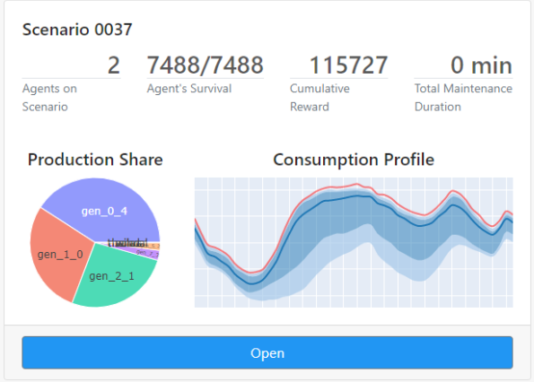

.. Grid2Viz documentation master file, created by
   sphinx-quickstart on Mon Jul  6 15:18:05 2020.
   You can adapt this file completely to your liking, but it should at least
   contain the root `toctree` directive.

Welcome to Grid2Viz's documentation!
====================================
Grid2Viz is a web application that offers several interactive views into the results of Reinforcement Learning agents that ran on the `Grid2Op <https://github.com/rte-france/Grid2Op>`_ platform.

.. toctree::
   :maxdepth: 2
   :caption: Installation and starting-kit

   installation.rst
   running-the-app.rst
   starting-kit.rst
   caching.rst

.. toctree::
   :maxdepth: 2
   :caption: Grid2Viz views

   views/scenario_selection.rst
   views/scenario_overview.rst
   views/agent_overview.rst
   views/agent_study.rst

