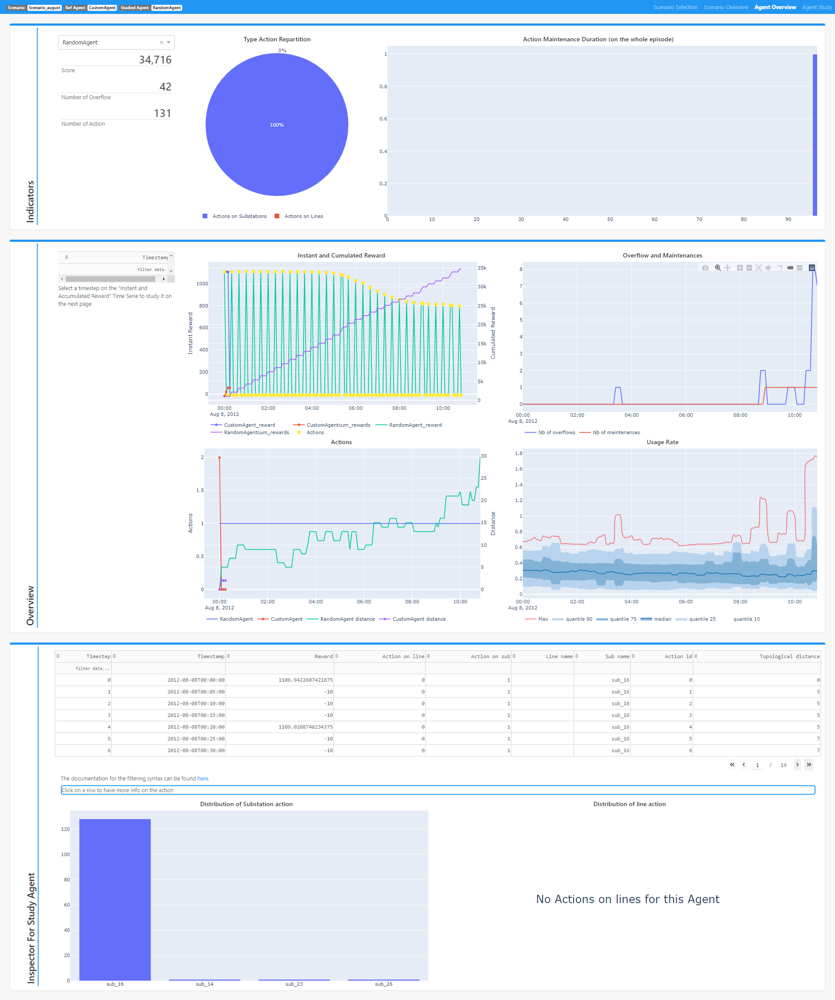

**************
Agent Overview
**************

The Agent Overview offers some preliminary insights on the studied agent (compared to the reference agent selected in the :doc:`Scenario Overview<scenario_overview>` view). The view is composed of three main sections described below.

Indicators
----------
This section allows to select the agent to be studied through a dropdown and :
 - Some synthetic information : 
                              - The score
                              - The number of overflows
                              - The Number of actions played
 - A *Pie Chart* representing the **types of actions** that the agent played.
 - An *Histogram* representing the duration of Maintenances (counted on the whole scenario).

Overview
--------
This section allows to interactively explore a series of 4 synchronised graphs :

- **Instant and Cumulated Reward** : Reward and cumulative reward time series for the reference agent and the studied agent. The time steps when the studied agent took an action are highlighted with a yellow mark.
- **Overflow and Maintenances** : Time series for the overflows generated by the studied agent and the maintenances seen by the agent.
- **Actions** : Time series for the action events (1 if an action is taken, 0 otherwise) and the distance of the current network topology from the orignal topology. Hovering over the action events time series will display the string representation of the action.
- **Usage Rate** : Same graph as in :doc:`Scenario Overview<scenario_overview>` but for the studied agent.

The time frame for these graphes is the one of the studied agent.

Additionnaly, clicking on any of the lines of the **Instant and Cumulated Reward** graph will select the corresponding time step and add it in the table on the left. These selected time steps will then be available in the :doc:`Agent Study<agent_study>` to allow specific focuses around those time steps.

Inspector for studied agent
---------------------------

This section offers a detailed table referencing the impacts of the actions taken by the studied agent. Clicking on any cell will display, below the table, the string representation of the action, if any, taken at the corresponding time step.
The section is completed by two graphs representing histograms of substations and lines targeted by the action of the studied agent over the whole scenario.

