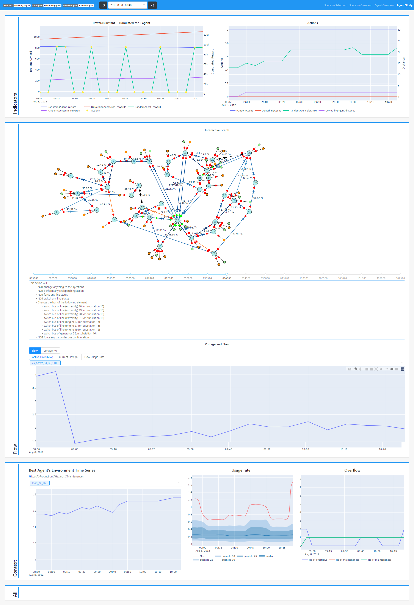

***********
Agent Study
***********

The Agent Study view allows to explore further the actions taken by an agent and their impacts. The view is composed of three main sections described below.

The navbar displays for this view a special component, namely a time frame selector. It is composed of a dropdown menu allowing to select one of the time step extracted from the :doc:`Agent Overview<agent_overview>` view. The -5 and +5 buttons allows to extend the default time frame (10 timesteps on each side of the selected time step).

Indicators
----------
This section displays the same **Instant and Cumulated Reward** and **Actions** graphs as the :doc:`Agent Overview<agent_overview>` view, but centered around the selected time step.

Flow
----

This sections provides a `Grid2Op <https://github.com/rte-france/Grid2Op>`_ plot representation of the network. A slider, on the same time frame as the **Indicators** graphs allows to navigate between the corresponding network states. The string representation of the action for a given time step is again provided below the slider.

The section is completed with a collection of time series representing flows accross lines and voltages with different units.

Context
-------

The Context section is a useful reminder of the environment time series, as seen by the studied agent, the usage rate graph and the overflows and maintenances graph.

