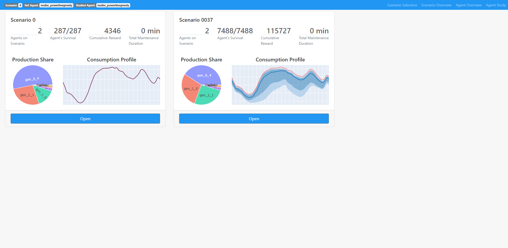

******************
Scenario Selection
******************

This view offers a synthetic summary of the available scenarios and the agents that ran on these scenarios. Each card represent a scenario that 
 * displays some synthetic indicators about the scenarios and the agents that ran on them
 * can be further analyzed by clicking the **open** button which will open the Scenario Overview view

