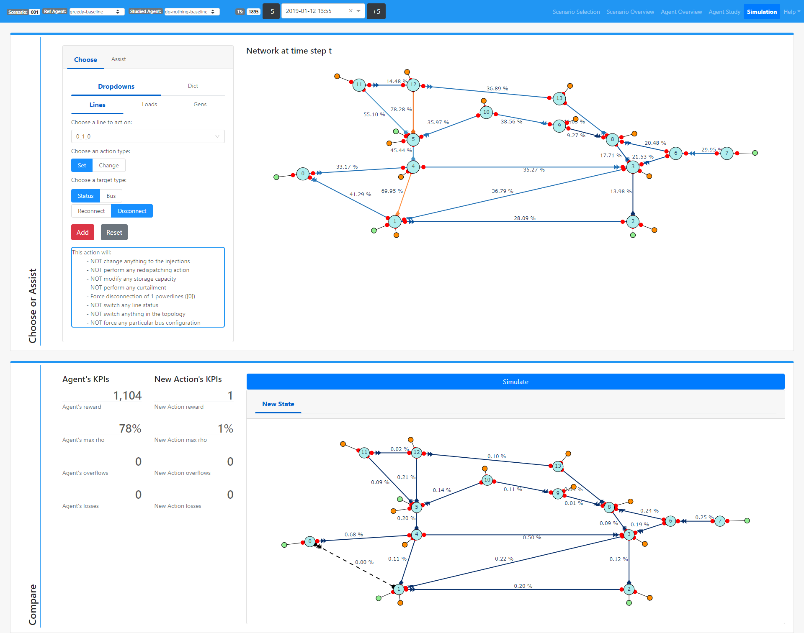
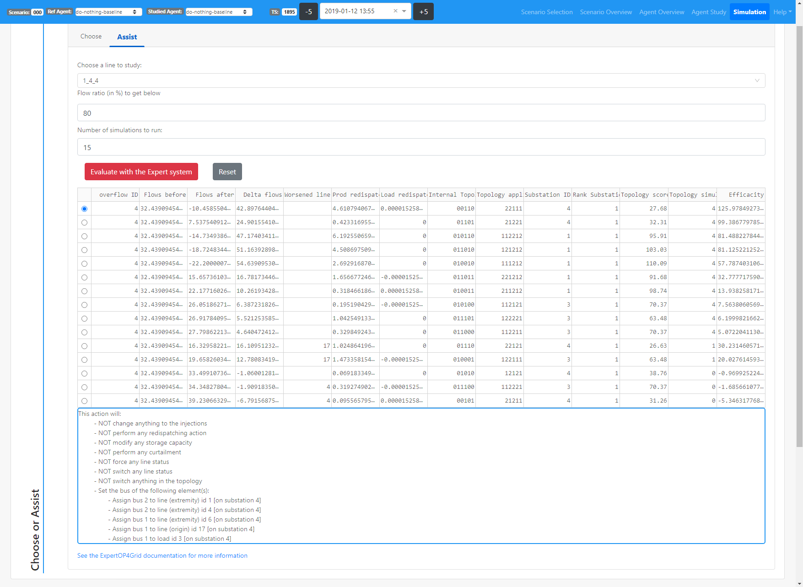
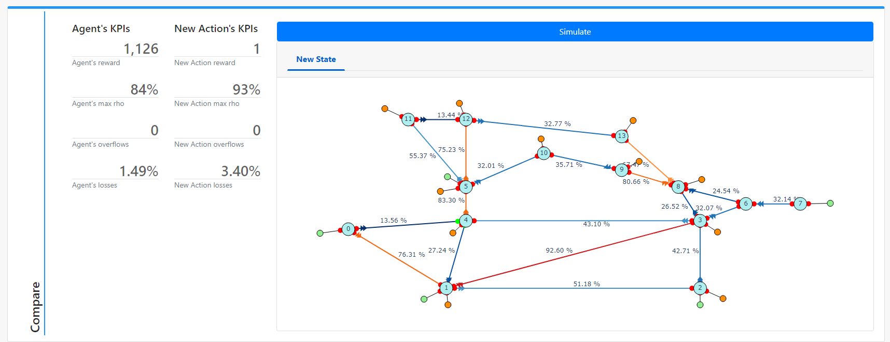

**********
Simulation
**********

.. note::
   The simulation view is still a BETA feature (works only with a DoNothing agent) and is accessible through the --activate-beta command line argument

The Simulation view allows to replay a specific time step with custom actions, either built as a collection of atomic actions, or with an assistant. The resulting simulated observation can then be compared to the original observation.

This view allows to explore what would have happen if the agent had taken another set of actions.

As for the Agent Study view, the studied time step in the Simulation view can be selected in the Agent Overview view and then changed in the navigation bar.

Chose or Assist
---------------

This section allows to configure the action to be simulated. Two options are available :

- A manual configuration through a set of radio buttons and dropdowns that allow to select a specific object and a specific action to apply on. Such actions add up with the Add button.
- An assisted action configuration through an assistant pluggin:
 - Right now, only the expert system `ExpertOp4Grid <https://github.com/marota/ExpertOp4Grid>`_ is provided with the application. An interface is exposed to implement other pluggins.

Compare
-------

This sections provides the `Grid2Op <https://github.com/rte-france/Grid2Op>`_ plot representation of the grid after the action has been simulated and a set of KPIs.

Use Case for the Assistant
----------------------------
With the data provided in the starting kit, we can go through a small use case of the ExpertOp4Grid assistant.
Configuration :

- agent do-nothing-baseline
- scenario 000
- time_step 1895

- Line to Act on : 1_4_4
- Flow ratio (in %) to get below : 80 (The current flow is 83.95%)

.. image:: ../_static/simulation_use_case_config.png

Evaluate the expert system and choose the first (i.e. best) action. It will reconfigure the substation 4 to make to flow on line 1_4_4 go below 80%.

You can now see the results by simulating the action in the Compare section. The flow on 1_4_4 is now way below 80% but at the cost of a higher flow on adjacent lines and higher losses.

